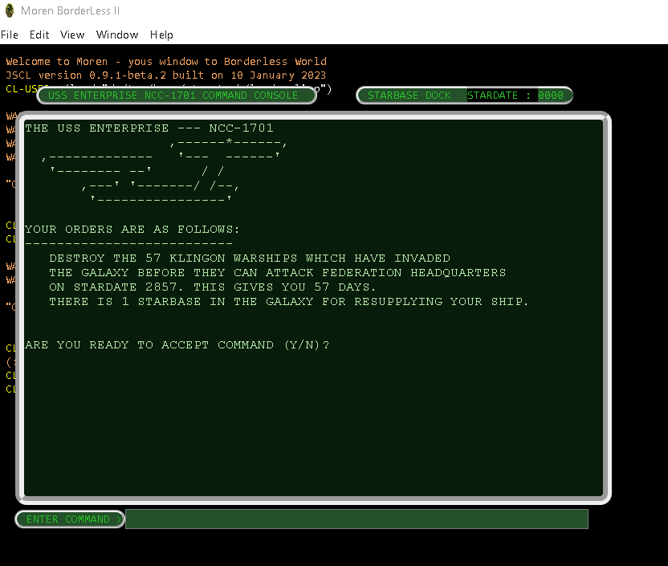
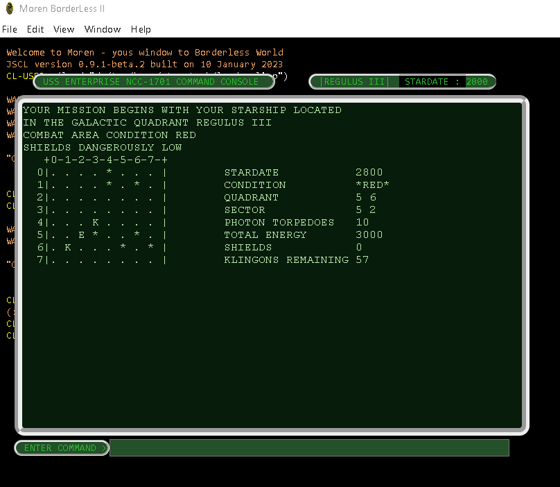
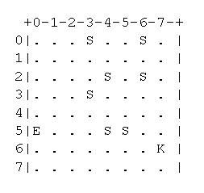
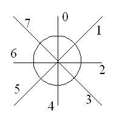

# Star Trek game
This is an old game based on the all time hit __"Star Trek"__. 

The original game was written in __`Basic`__ by __`Mike Mayfield's, 1971`__. 

Rewritten in __`Common Lisp`__ by __`Shozo TAKEOKA, 2006, take@axe-inc.co.jp`__ [http://www.takeoka.org/~take/](http://www.takeoka.org/~take/trek/trek-man-e.html). 

See __`original/trek.lsp`__ in this repository.

The presented version was adapted for the __`Moren environment, 2017`__ and has not been previously published.
>>> __`Moren environment,2017`__ `outdate port, see by ref: https://github.com/vlad-km/moren-electron` 

Dedicated to those, who gamed __`StarTrek`__ on  __`OS/MFT`__.


___

## Development status - DEBUGGING
Under construction - redesign under __`JSCL Moren Edition`__, __`Electron`__ .


>>> `Damn, this code, ancient, as a mammoth shit...` 

<p align="center">
  <a href="https://github.com/vlad-km">
    
  </a>
</p>

In this implementation the stars are represented by the symbol _`*` _

<p align="center">
  <a href="https://github.com/vlad-km">
    
  </a>
</p>

___

## Navigation


Coordinates System
displayed as (X,Y), that means (_`see below`_): 
- X  _`by vertical`_
- Y  _`by horizontal`_

___
<p align="center">
  <a href="https://github.com/vlad-km">
    
  </a>
</p>

```
        DIRECTION IS IN A CIRCULAR NUMERICAL       7    0    1
        VECTOR ARRANGEMENT AS SHOWN.                `.  :  .' 
        INTERGER AND REAL VALUES MAY BE               `.:.'   
        USED.  THEREFORE COURSE 1.5 IS             6---<*>---2
        HALF WAY BETWEEN 1 AND 2.                     .':`.   
                                                    .'  :  ` .
                                                    5   4    3
      
                                                     COURSE
      
        ONE 'WARP FACTOR' IS THE SIZE OF ONE QUADRANT. THEREFORE
        TO GET FROM QUADRANT 5,6 TO 5,5 YOU WOULD USE COURSE 3
        WARP FACTOR 1. COORDINATES ARE SPECIFIED USING X Y NOTATION
        WITH X 1-8 FROM LEFT-RIGHT AND Y 1-8 FROM TOP-BOTTOM.
```

### Legend
- E __`Enterprise`__ _`is at (5,0)`_
- K __`Klingon`__ _`is at (6,7)`_
- S __`Star`__ _`lot of them`_

___

## Direction specification (Warp/Torpedo)

You can specify with real number (ex. floating point).

___

<p align="center">
  <a href="https://github.com/vlad-km">
    
  </a>
</p>

___


## Command reference

### Commands

- W  _`WARP`_
- S  _`FOR SHORT RANGE SENSOR SCAN`_
- L  _`FOR LONG RANGE SENSOR SCAN`_
- P  _`TO FIRE PHASERS`_
- T  _`TO FIRE PHOTON TORPEDOES`_
- Z  _`TO RAISE OR LOWER SHIELDS`_
- R  _`FOR DAMAGE CONTROL REPORTS`_
- C  _`TO CALL ON LIBRARY-COMPUTER`_
- X  _`TO RESIGN YOUR COMMAND`_


### Library Computer Commands

- G  _`CUMULATIVE GALACTIC RECORD`_
- S  _`STATUS REPORT`_
- T  _`PHOTON TORPEDO DATA`_
- B  _`STARBASE NAV DATA`_
- N  _`DIRECTION/DISTANCE CALCULATOR`_
- Z  _`GALAXY *REGION NAME* MAP`_

___

## Supported platform:
- Windows
- NodeJS
- Electron

___

## Relevant information
1. Shozo TAKEOKA    http://www.takeoka.org/~take/trek/trek-man-e.html
2. Super Star Trek  https://www.atariarchives.org/bcc1/showpage.php?page=275
3. Mike Mayfield's  http://www.dunnington.u-net.com/public/startrek/STTR1
4. Terry Newton     http://newton.freehostia.com/hp/bas/TREKPT.txt


___

## Copyright
Copyright © 2017,2023 Vladimir Mezentsev


