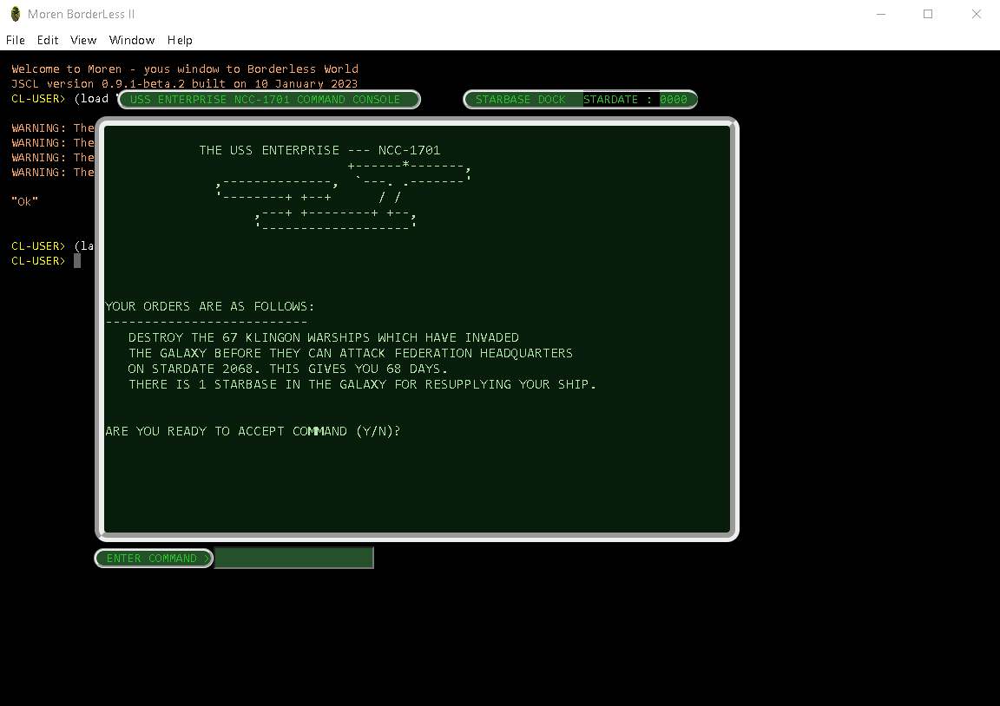
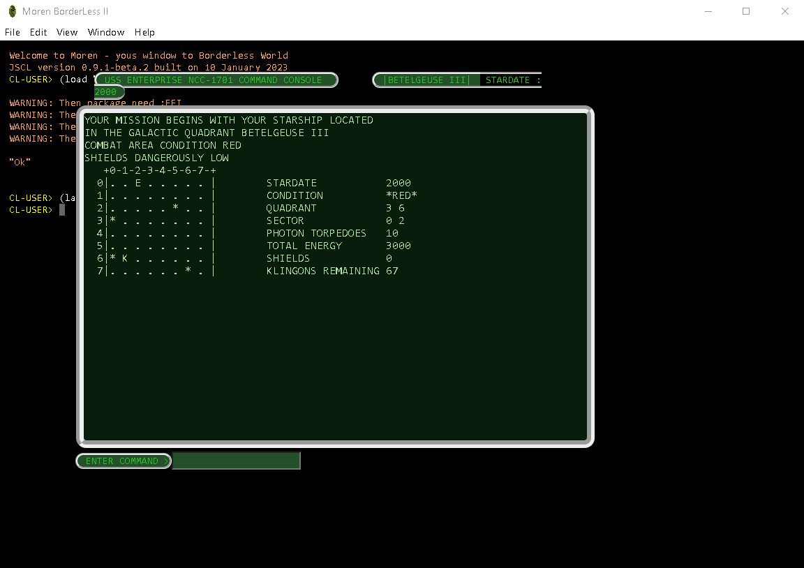

# Star Trek game
This is an old game based on the all time hit __"Star Trek"__. 

The original game was written in __`Basic`__ by __`Mike Mayfield's, 1971`__. 

Rewritten in __`Common Lisp`__ by __`Shozo TAKEOKA, 2006, take@axe-inc.co.jp`__ [http://www.takeoka.org/~take/](http://www.takeoka.org/~take/trek/trek-man-e.html). 

See __`original/trek.lsp`__ in this repository.

The presented version was adapted for the __`Moren environment, 2017`__ and has not been previously published.
>>> __`Moren environment,2017`__ `outdate port, see by ref: https://github.com/vlad-km/moren-electron` 

Dedicated to those, who gamed __`StarTrek`__ on  __`OS/MFT`__.

___

## Development status - DEBUGGING
Under construction - redesign under __`JSCL Moren Edition`__, __`Electron`__ .

>>> `Damn, this code, ancient, as a mammoth shit...` 

  

  

___

## Supported platform:
- Windows
- NodeJS
- Electron

___

## Relevant information
1. Shozo TAKEOKA    http://www.takeoka.org/~take/trek/trek-man-e.html
2. Super Star Trek  https://www.atariarchives.org/bcc1/showpage.php?page=275
3. Mike Mayfield's  http://www.dunnington.u-net.com/public/startrek/STTR1
4. Terry Newton     http://newton.freehostia.com/hp/bas/TREKPT.txt

___

## Copyright
Copyright © 2017,2023 Vladimir Mezentsev

